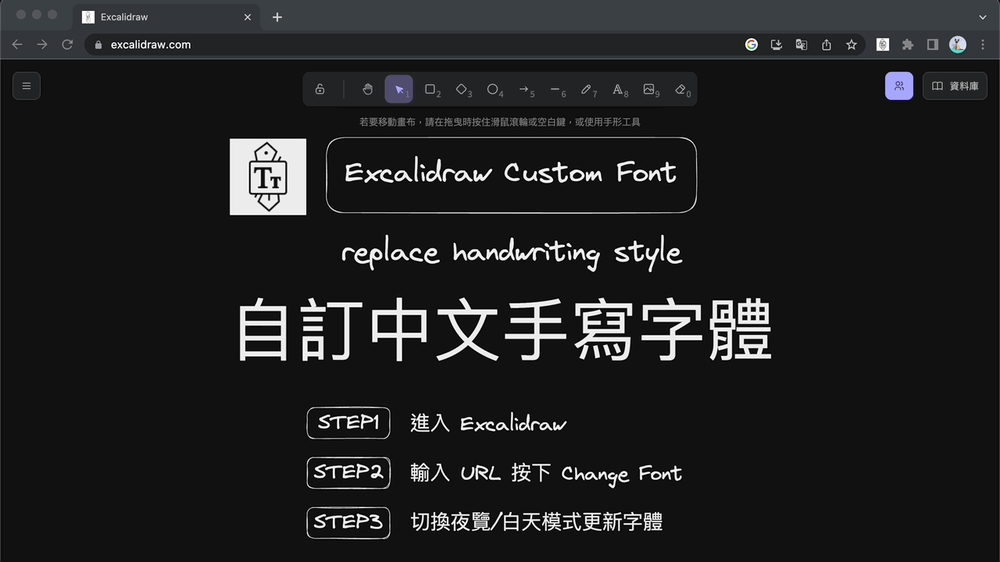

# excalidraw-custom-font
Resource of Excalidraw custom font Chrome Extension

## DEMO

## How to use?

Install Chrome extension [Excalidraw custom font](https://chrome.google.com/webstore/detail/excalidraw-custom-font/afbeaojffbjckicjpkecknoocdpmgoah)

1. Visit Excalidraw.
2. Enter font URL and click "Change font".
3. Toggle Night/Day mode to trigger font update.

## Customise with your favorate font

This extension replace the original handwriting font with URL you enter. So, you can also use any Japan, Korean, English or Chinese fonts.

## Troubleshooting

Support woff2 URL currenlty. Please visit [issue](https://github.com/jcyh0120/excalidraw-custom-font/issues) if you need other font formats.