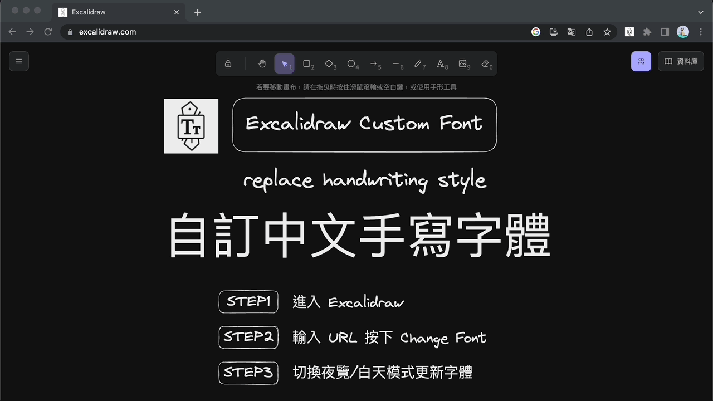

# excalidraw-custom-font

Resource of Excalidraw custom font Chrome Extension

ReadMe Language ([Chinese](./README.md) / [English](./README.en.md))

## DEMO

## 如何使用？

安裝 Chrome extension [Excalidraw custom font](https://chrome.google.com/webstore/detail/excalidraw-custom-font/afbeaojffbjckicjpkecknoocdpmgoah)

1. 進入 Excalidraw
2. 輸入 URL 按下 Change font
3. 切換夜覽/白天模式 (觸發字體更新)

## 去哪找手寫中文字型?

* https://github.com/max32002/JasonHandWritingFonts

(歡迎提供更多好用的字型 [Discussion](https://github.com/jcyh0120/excalidraw-custom-font/discussions/1))

## Troubleshooting

目前僅支援 woff2 字型的 URL，如有其他需求請到 [issue](https://github.com/jcyh0120/excalidraw-custom-font/issues) 提出
